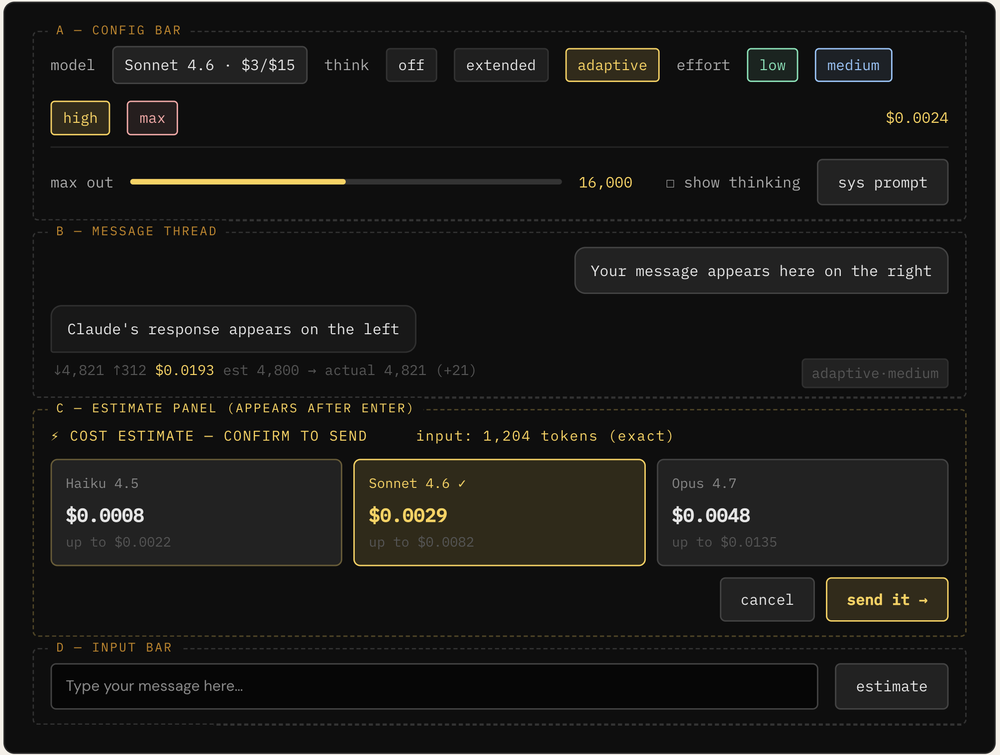

# ⚡ Claude Token Estimator

A lightweight chat interface that **counts tokens and estimates cost before every API call**. Compare costs across models at the moment you decide to send.

[](https://vercel.com/new/clone?repository-url=https://github.com/YOUR_USERNAME/token-estimator)



## Features

- Exact token count before sending (uses Anthropic's `/v1/messages/count_tokens`)
- Cross-model cost comparison at estimate time — switch models before committing
- Extended thinking / adaptive thinking / effort level controls
- Session cost tracker
- API key stored locally in your browser, never leaves your machine

## Quick start

```bash
git clone https://github.com/YOUR_USERNAME/token-estimator
cd token-estimator
npm install
npm run dev
```

Open [http://localhost:5173](http://localhost:5173), paste your Anthropic API key, and go.

## Deploy to Vercel (free)

1. Push this repo to GitHub
2. Go to [vercel.com](https://vercel.com) and click **Add New Project**
3. Import your GitHub repo — no environment variables needed
4. Deploy

Or use the button at the top of this README for a one-click deploy.

## Getting an API key

Get yours at [console.anthropic.com](https://console.anthropic.com). The key is stored only in your browser's `localStorage` and sent directly to `api.anthropic.com` — this app has no backend.

## Build for production

```bash
npm run build
```

Output goes to `dist/` — deploy that folder anywhere (Vercel, Netlify, GitHub Pages, etc).

## Notes

- Requires an Anthropic API key with access to the models you want to use
- Thinking/effort features require Sonnet or Opus models
- Output cost estimates are approximate — actual output length varies
