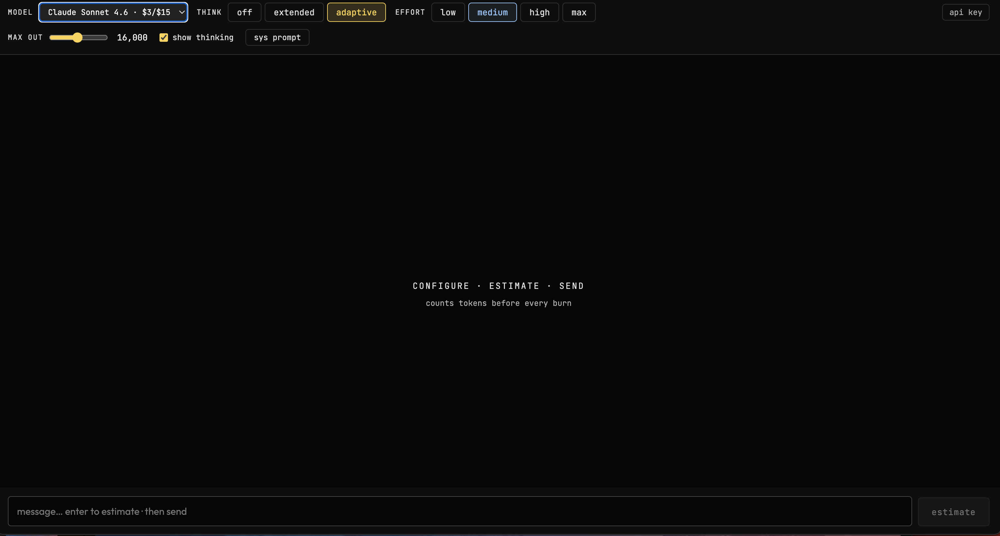

# ⚡ Claude Token Estimator

A chat interface that **counts tokens and estimates cost before every API call**. See exactly what you're about to spend, compare across models, then decide to send or cancel.

[](https://vercel.com/new/clone?repository-url=https://github.com/arielnishri-svg/token-estimator)




---

## Why this exists

Claude.ai hides token counts and costs from you. This tool exposes everything: exact input tokens, estimated output cost and a side-by-side model comparison - all before you commit to a single API call.

---

## Features

- **Exact token count** before sending via Anthropic's `/v1/messages/count_tokens` (free call)
- **Cross-model cost comparison** at estimate time — switch models before committing
- **Thinking mode controls** — off / extended / adaptive with effort levels (low → max)
- **Thinking budget slider** for extended mode (1,024–32,000 tokens)
- **Session cost tracker** — running total tokens and spend in the top bar
- **Estimate accuracy feedback** — see actual vs estimated tokens after each response
- **System prompt** — persistent instructions prepended to every message
- **API key stored locally** in your browser's localStorage, never sent anywhere except `api.anthropic.com`

---

## How it works

```
Configure settings → Type message → Press Enter → Review cost estimate → Send or cancel
```

1. **Configure** — pick model, thinking mode, effort, max output tokens
2. **Type** your message and press Enter (or click Estimate)
3. **Review** — exact input token count, estimated output cost, all models compared side by side
4. **Switch models** in the estimate panel if needed — click any card to switch before sending
5. **Send** — see actual vs estimated token count after the response

> Estimating is free. Anthropic does not charge for `/v1/messages/count_tokens` calls.

---

## Model & mode guide

| Model | Price | Best for |
|-------|-------|----------|
| Haiku 4.5 | $1/$5 per MTok | Short rewrites, classification, simple Q&A, high-volume tasks |
| Sonnet 4.5 | $3/$15 per MTok | Coding, writing, analysis |
| Sonnet 4.6 | $3/$15 per MTok | Coding, writing, analysis — start here for most tasks |
| Opus 3 | $15/$75 per MTok | Legacy flagship — strong reasoning, wide knowledge |
| Opus 4.6 | $15/$75 per MTok | Complex reasoning, hard debugging |
| Opus 4.7 | $15/$75 per MTok | Hardest tasks — maximum capability, quality > cost |

| Thinking mode | When to use |
|---------------|-------------|
| off | Simple tasks, rewrites, short answers |
| adaptive · low | Light analysis, drafting |
| adaptive · medium | Default for most tasks |
| adaptive · high | Code review, strategy, careful reasoning |
| adaptive · max | Hardest problems — Claude thinks as much as it wants |
| extended | Set an exact thinking token budget manually |

---

## Quick start

```bash
git clone https://github.com/arielnishri-svg/token-estimator
cd token-estimator
npm install
npm run dev
```

Open [http://localhost:5173](http://localhost:5173), paste your Anthropic API key, and go.

Get a key at [console.anthropic.com](https://console.anthropic.com).

---

## Deploy to Vercel (free)

1. Push this repo to GitHub
2. Go to [vercel.com](https://vercel.com) → **Add New Project**
3. Import your GitHub repo — no environment variables needed
4. Deploy

Or use the **Deploy with Vercel** button at the top of this README.

---

## Troubleshooting

| Symptom | Fix |
|---------|-----|
| `effort: Extra inputs are not permitted` | Switch thinking mode — effort is only valid in `off` mode |
| Models show "loading…" | API call failed; falls back to Haiku / Sonnet / Opus automatically |
| Estimate resets after typing | By design — editing message or settings requires a fresh estimate |
| Think budget slider missing | Only visible in `extended` mode |
| Effort pills missing | Only visible in `adaptive` or `off` mode on capable models (not Haiku) |

---

## Notes

- Thinking/effort features require Sonnet or Opus — Haiku does not support them
- Output cost estimates are approximate; actual output length varies
- Thinking tokens bill at the same rate as output tokens
